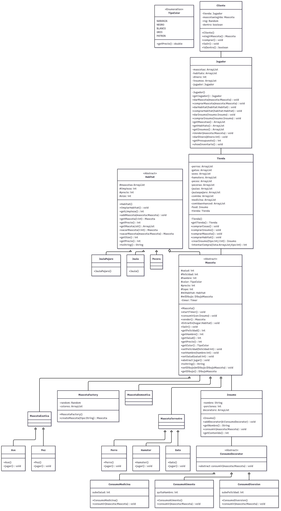

# TiendaMascotas

# Grupo 2
    Antonella Pincheira Poblete
    Pablo Vargas Pino
# Casos de uso

# UML de parte Gráfica

# Prototipo de interfaz

# Patrones utilizados
    Factory: Cada animal tiene un distinto rango de parámetros que simula algunos de la vida real. En la vida real, estos parametros no son decididos por un humano, por lo que es mejor crear una "fábrica" que asigne estos de forma random.
    Este patrón nos ayuda a evitar escribir cuatro parametros distintos en cada creación de mascota, y además simula el poco control que tenemos sobre estos en la naturaleza.
    Una "fabrica" de mascotas tiene la habilidad de crear cualquiera de las mascotas que tenemos, e internamente asigna felicidad, hambre y salud iniciales, junto al color del animal.
    
    Decorator: En la vida real, hay insumos para mascotas que tienen distintos valores nutricionales, medicinales y son más gustados por mascotas.
    Esto lo replicamos con un insumo generico que luego es "decorado" con distintos atributos que mejoran la salud, hambre y felicidad de la mascota que los consume.

    Singleton: Como hay solo un jugador, es lógico crearlo como un singleton, de forma similar, todas las tiendas son creadas de la misma forma, y se rellenan de forma automática, por lo que no es necesario tener múltiples.
    En la parte gráfica, MiTienda es única, junto a MoneyCount (somos sólo un jugador, con una única tienda y un único presupuesto). Las ventana y Sprites también son definidos como singleton, ya que es mejor crear uno y tener acceso a este que accidentalmente crear más.

# Avances 
    Semana 0: Creamos diagramas UML (de clase y uso), y en base a eso contruimos parte de la base, principalmente relacionado a mascotas.
    Creamos un pequeño mockup de cómo nos gustaría hacer la interfaz gráfica, junto a un prototipo en código.
    
    Semana 1: Implementamos nuevos patrones de diseño que ayudan con la creación y complejidad de las mascotas y los elementos con los que se relacionan.
    Se establece un sistema de valor monetario para las mascotas, dependiente de sus atributos.

    Semana 2: Creamos clase jugador que puede comprar insumos, mascotas y habitats. Habitats ahora tienen un tamaño que les permite agregar una cantidad limitada de mascotas.

    Semana 3: Creación de clase Tienda, encargada de la creación de insumos, mascotas y habitats disponibles para jugador. Implementación de escenas y componentes principales de la interfaz gráfica, comprador puede comprar mascotas y el Jugador puede alimentarlas y jugar con ellas.

# Siguientes pasos
    Crear interfaz gráfica para Tienda y los hábitats.
    Seguir evolucionando nuestros gráficos. 
    Mejorar el sistema de habitats. + Habitats se ensucian y se pueden limpiar.
    JUnits.

# Ideas para (posible) futura implementación
    Agregar un sistema de "upgrades" de habitats, donde se pueden agrandar por algún precio.
    
# Características de nuestra tienda de mascotas
    Cada cierto tiempo cosas como felicidad, limpieza del habitad y salud disminuyen. Hambre aumenta.
    Si los atributos están en un rango negativo para la mascota, su precio disminuye.
    Medicinas y alimento pueden ser comprados en distintas cantidades, afectando su precio.
    Jugador puede rechazar la oferta de un comprador de comprar la mascota. 
    Hay distintos tipos de insumo que mejoran ciertas "stats" de la mascota. 
    Al jugar la felicidad aumenta, pero el hambre también.