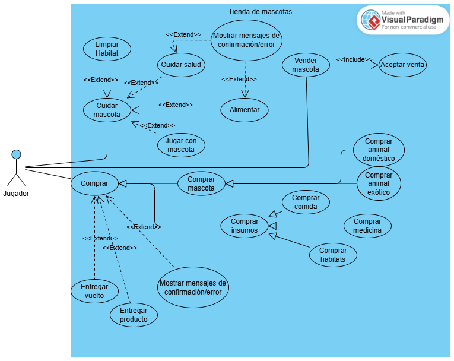

# TiendaMascotas

# Grupo 1
    Antonella Pincheira Poblete
    Pablo Vargas Pino
# Casos de uso

# UML

# Prototipo de interfaz

# Avances 
    Creamos diagramas UML (de clase y uso), y en base a eso contruimos parte de la base, principalmente relacionado a mascotas.
    Creamos un pequeño mockup de cómo nos gustaría hacer la interfaz gráfica, junto a un prototipo en código.

# Siguientes pasos
    Seguir con los elementos con los que se relacionan las mascotas y lograr una lógica firme.
    Seguir evolucionando nuestros prototipos gráficos.